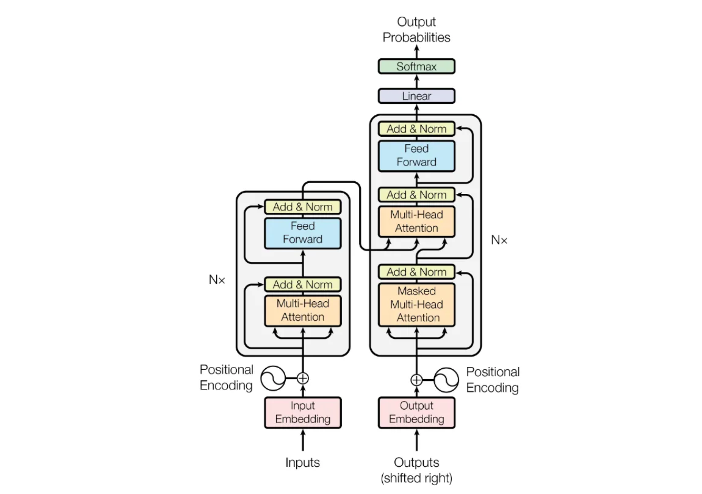

# Transformer Translator Model [TTM]

---

Будущее описание модели

--- 

About GPT model

A machine learning model based on the architecture of a generative pre-trained transformer has been uploaded to this repository. 

## What is GPT

The abbreviation GPT stands for Generative Pretrained Transformer, which means "generative pre-trained transformer". Let's look at what lies behind these words.

The first thing they tell us is that such models generate new text. That is, they do not just classify or analyze data, but create original texts. This is a very powerful ability that underlies tools like ChatGPT, Claude and Gemini, which are able to generate coherent and meaningful texts based on small promptings.

The second part, "pre-trained", means that these models have gone through a pre-training process on huge amounts of data before being applied to specific tasks. This preliminary stage of training allows the model to absorb extensive knowledge about the language, the world and many other areas that

---
